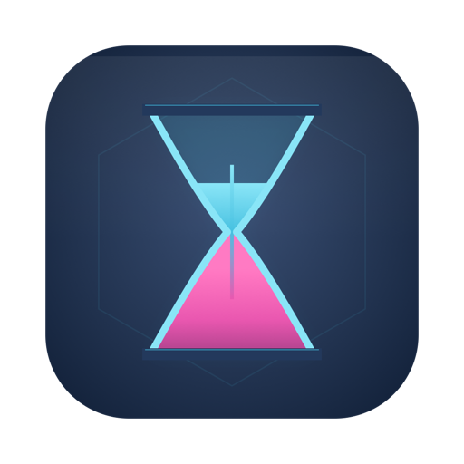
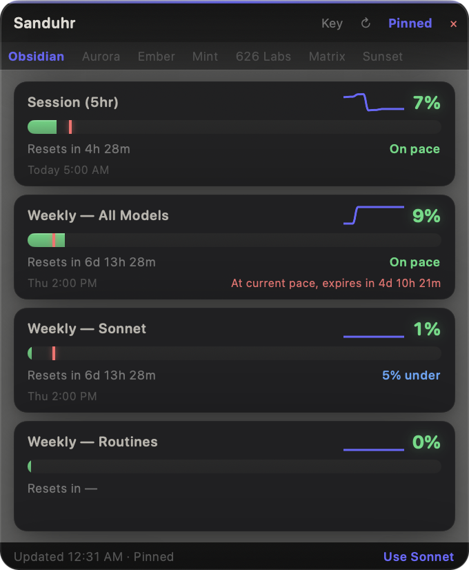
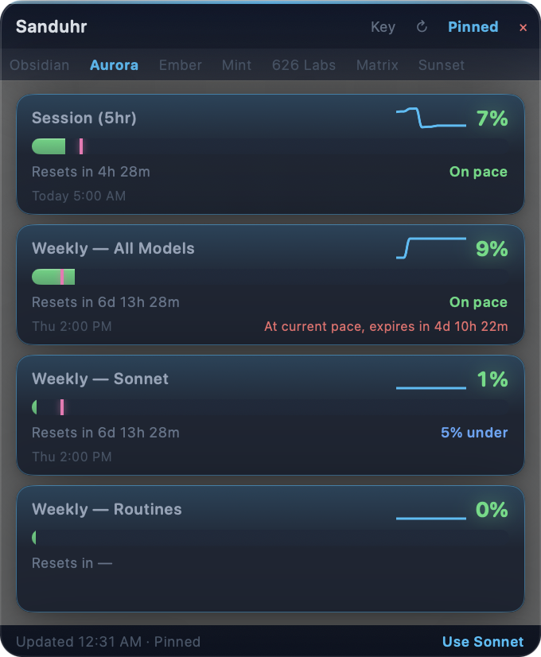
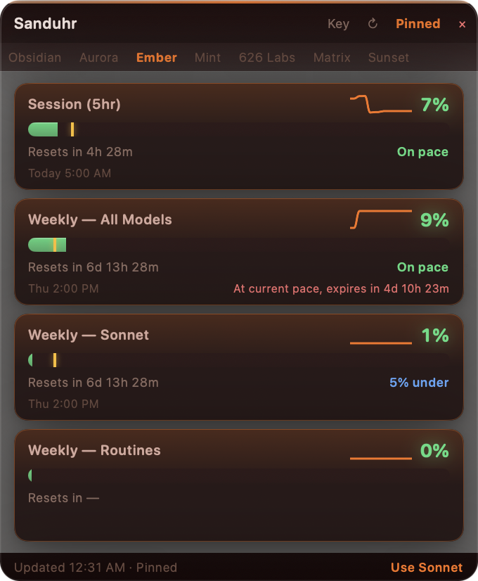
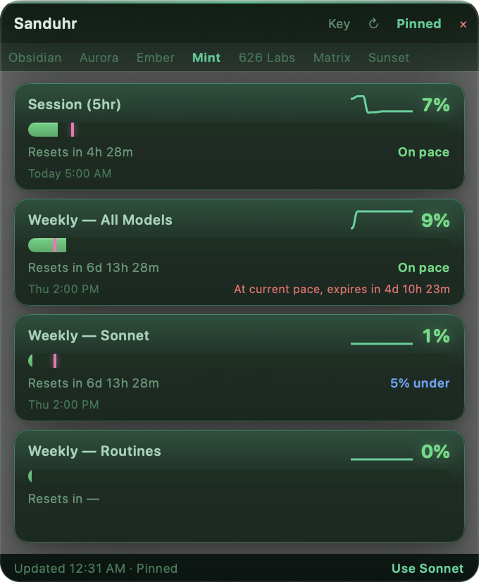
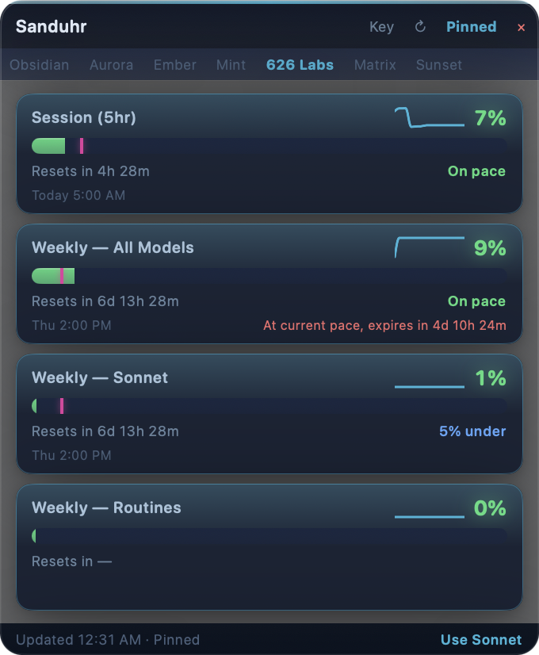
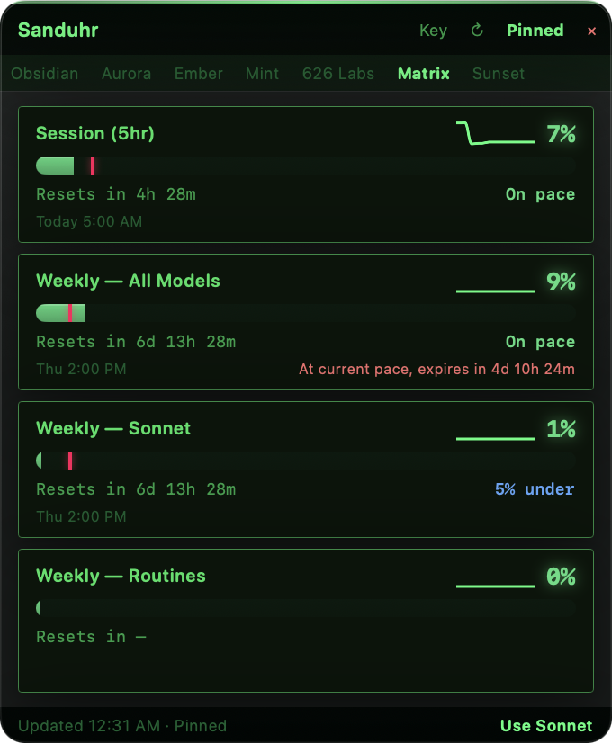

<p align="center">
  
</p>

<h1 align="center">Sanduhr für Claude</h1>

<p align="center"><em>Hourglass for Claude — watch your usage sand drain.</em></p>

<p align="center">
A glassmorphism desktop widget that shows your Claude.ai subscription usage
with burn-rate projections, pace markers, and sparklines. Know at a glance
whether you're burning through your limits too fast — or have room to push harder.
</p>

<p align="center">
  <strong>macOS</strong> · <strong>Windows</strong> · <strong>Python (any OS)</strong>
</p>

---

## Themes

Six built-in themes, plus drop-in JSON themes you can author from a reference
image using the [theme-builder AI prompt](docs/themes/AGENT_PROMPT.md).

<table>
  <tr>
    <td align="center" width="33%"><br><strong>Obsidian</strong><br><sub>deep black · purple accent</sub></td>
    <td align="center" width="33%"><br><strong>Aurora</strong><br><sub>dark blue · cyan glow</sub></td>
    <td align="center" width="33%"><br><strong>Ember</strong><br><sub>dark red · orange warmth</sub></td>
  </tr>
  <tr>
    <td align="center" width="33%"><br><strong>Mint</strong><br><sub>dark green · terminal vibes</sub></td>
    <td align="center" width="33%"><br><strong>626 Labs</strong><br><sub>navy · cyan · magenta</sub></td>
    <td align="center" width="33%"><br><strong>Matrix</strong><br><sub>phosphor · CRT corners</sub></td>
  </tr>
</table>

Drop a custom theme JSON into `~/Library/Application Support/Sanduhr/themes/`
(macOS) or `%APPDATA%\Sanduhr\themes\` (Windows) and it appears in the theme
strip on next launch.

---

## Install

### macOS (native SwiftUI)

Download the latest **Sanduhr.dmg** from
[Releases](https://github.com/estevanhernandez-stack-ed/Sanduhr_f-r_Claude/releases),
drag the app to Applications, launch.

- Signed with Developer ID + notarized by Apple — no Gatekeeper warnings.
- Menu-bar status item shows your highest-utilization percentage at a glance.
- Floating panel docks top-right by default; drag it anywhere.
- Auto-updates via [Sparkle](https://sparkle-project.org) (24h check interval).
- Requires macOS 14+ (Sonoma).

### Windows (native Qt)

See the [`windows-native`
branch](https://github.com/estevanhernandez-stack-ed/Sanduhr_f-r_Claude/tree/windows-native)
for the PyQt6 build. Uses Win11 Mica glass when available, falls back cleanly
on Win10. Installer script + GitHub Actions release workflow included.

### Python (cross-platform, single file)

```bash
python sanduhr.py
```

Single-file tkinter app; auto-installs `cloudscraper` on first run. Minimal
setup, classic look, works on macOS / Windows / Linux. Requires Python 3.8+.

---

## How it works

Sanduhr calls two Claude.ai API endpoints — the same ones the settings page uses:

- `GET /api/organizations` — your organization id
- `GET /api/organizations/{orgId}/usage` — utilization % + reset timestamps

### First-run setup

1. Go to [claude.ai](https://claude.ai) and sign in.
2. Open DevTools (`⌥⌘I` on macOS, `F12` on Windows).
3. Navigate to **Application → Cookies → claude.ai**.
4. Copy the value of the `sessionKey` cookie.
5. Paste it into Sanduhr's first-launch dialog.

Your session key is stored locally — macOS Keychain on the native build,
`~/.claude-usage-widget/config.json` (or `%APPDATA%\Sanduhr\config.json`) on
the others. It never leaves your machine.

**Key expiration:** Session keys expire when you log out of claude.ai or after
extended inactivity. If Sanduhr shows "Session expired," paste a fresh key via
the settings menu.

---

## Features

- **Real-time usage bars** — Session (5hr), Weekly All Models, Sonnet, Opus, Cowork, Routines
- **Burn-rate projection** — "Hits 100% in ~4h 22m" warns before you run dry
- **Usage sparklines** — trend chart per tier over the last 2 hours
- **Pace markers** — colored tick on each bar showing where "on pace" is right now
- **Pacing engine** — ahead / behind / on pace, color-coded at a glance
- **Reset countdown + date/time** — "3d 6h" and "Sun 1:00 AM" side by side
- **Compact mode** — double-click the title bar to collapse to the highest-usage tier
- **Theme system** — six built-in + drop-in user JSON themes
- **Always-on-top** — pin/unpin from the title bar
- **Draggable + persistent position** — click the title bar and reposition anywhere
- **Graceful updates** — no flicker; countdowns tick every 30s; data refreshes every 5 min
- **Use Sonnet link** — footer shortcut to open Claude with Sonnet pre-selected

---

## Pacing logic

Linear pace based on how far into the current period you are:

- **On pace** (green) — within 5% of where you'd expect to be
- **Ahead** (orange) — using faster than linear; the pace marker on the bar shows where you *should* be
- **Under** (blue) — plenty of headroom

The burn-rate projection goes one step further: if your current velocity would
exhaust the limit before the reset, it tells you exactly when you'll hit 100%.

---

## Controls

| Action | Effect |
|--------|--------|
| Click a theme name | Switch to that theme |
| Key button | Update your session key |
| Refresh button | Force a data refresh |
| × button | Hide the widget (menu-bar icon brings it back) |
| Pin button | Toggle always-on-top |
| Drag title bar | Reposition the widget |
| Double-click title | Toggle compact mode |
| "Use Sonnet" (footer) | Open claude.ai with Sonnet selected |

macOS builds also add a menu-bar status item with right-click menu for
Refresh, Credentials, Check for Updates, and Quit.

---

## Roadmap

- [ ] Antigravity (Google Gemini IDE) quota tracking
- [ ] Historical usage dashboard
- [ ] Auto-start on boot (native builds)
- [ ] Official Anthropic read-only usage endpoint support (pending Anthropic response)

---

## Why "Sanduhr für Claude"?

*Sanduhr* (ZAHND-oor) is German for "hourglass" — Sand + Uhr (sand clock). *Für* = "for."
You're watching the sand drain on your Claude usage, pacing yourself so you
don't run out before the reset.

---

## License

MIT — do whatever you want with it.

Built by [626Labs](https://github.com/626labs) with Claude.
